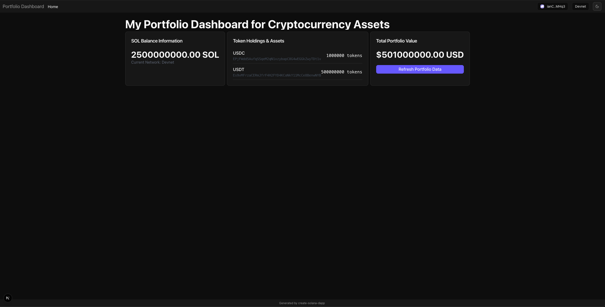

# 🎯 React/Solana Developer Screening Challenge

## Overview

This is a portfolio dashboard that allows a user to connect their Solana wallet and preview their balances. Your task is to make it production-ready. Try to spend no more than **30 minutes maximum**!.

## Your Task

The portfolio dashboard has several issues that need to be resolved. Your job is to identify and fix them.

## Requirements

### Functionality (60 points)

- [ ] Component renders without errors or performance issues
- [ ] SOL balance displays correctly
- [ ] All React patterns follow best practices
- [ ] Proper error handling and loading states
- [ ] TypeScript compilation succeeds

### Design & UX (40 points)

- [ ] Add "Third Time" logo and branding from public folder
- [ ] Change color scheme to purple/violet theme
- [ ] Fully responsive on mobile devices
- [ ] Professional, polished appearance
- [ ] Proper spacing and typography

## Evaluation Criteria

**Passing Score: 70/100**

We evaluate:

- Problem identification skills
- React/TypeScript expertise
- Web3/Solana knowledge
- Frontend design abilities
- Code quality and organization

## Instructions

1. **Fork this repository** to your own GitHub account
2. **Clone your forked repository** to your local machine
3. **Run `npm install && npm run dev`**
4. **Open the app and identify issues**
5. **Fix all problems you find**
6. **Test on both desktop and mobile**
7. **Commit and push your changes** to your forked repository
8. **Submit the link to your forked repository** for evaluation

## Hints

- Connect a wallet to see the full functionality. Phantom or Solflare can be installed from the Chrome plugin store, and once installed, make sure to choose "devnet" as your network.
- Test the component behavior carefully
- Pay attention to mobile responsiveness
- Check browser console for errors
- Consider Solana-specific formatting requirements

Good luck! 🚀
